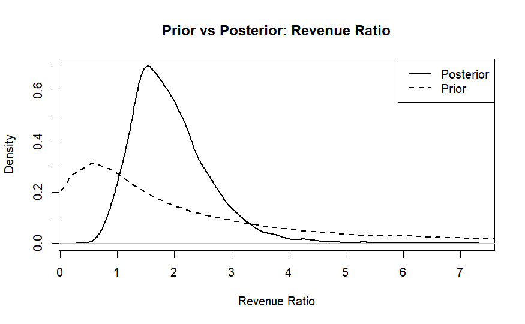

## Introduction:

This project investigates which film genre generates greater box office revenue: fantasy or science fiction. Both genres are popular in contemporary cinema and attract substantial investment, yet their relative commercial success remains an open question. Understanding which genre tends to gross more provides value to filmmakers, studios, and investors seeking to allocate resources effectively. Additionally, examining the box office performance of these genres offers insight into audience preferences and the financial viability of different creative directions in the film industry. Our primary research question is: do science fiction films gross significantly more than fantasy films on average? We hypothesize that science fiction films may have a slight edge in box office performance, though we remain open to the data.

## Methods:

**Data Source and Collection:** We obtained movie data from the IMDB Movies Ratings Details dataset, available on Kaggle (<https://www.kaggle.com/datasets/preetviradiya/imdb-movies-ratings-details>). The dataset contains information on thousands of films including title, genre, rating, and worldwide box office gross in millions of dollars. We filtered the dataset to include only films classified as fantasy or science fiction, removing entries with missing or zero gross values. This resulted in 55 fantasy films and 60 science fiction films for analysis.

APPENDIX\*\*\*

```{r setup, include=FALSE}
# Load packages
library(dplyr)
library(stringr)

# Load data
movies <- read.csv("IMDB_movie_reviews_details.csv")

# Filtering of the data
filtered_data <- movies %>%
  filter(str_detect(genre, regex("Fantasy|Sci-Fi", ignore_case = TRUE)))

head(filtered_data)
length(filtered_data$name)

#Removing empty "gross" and changing it to an int in millions

filtered_data <- filtered_data %>%
  filter(!is.na(gross), gross != "") %>%
  mutate(
    gross_clean = str_remove_all(gross, "[\\$,M]"),
    gross_millions = as.numeric(gross_clean)
  ) %>%
  select(-gross_clean) %>%
  select(-gross)


head(filtered_data)
```

```{r, echo=FALSE}
# Separate data sets
fantasyDat <- filtered_data %>%
  filter(str_detect(genre, regex("Fantasy", ignore_case = TRUE)))

scifiDat <- filtered_data %>%
  filter(str_detect(genre, regex("Sci-Fi", ignore_case = TRUE)))
# Summary stats for each group not on the log scale
summary(fantasyDat$gross_millions[fantasyDat$gross_millions > 0])

summary(scifiDat$gross_millions[scifiDat$gross_millions > 0])
```

**Data Summary:**

Fantasy films: minimum 0.06, first quartile 3.67, median 52.04, mean 110.73, third quartile 177.89, maximum 760.51.

Science fiction films: minimum 0.19, first quartile 22.68, median 74.70, mean 149.74, third quartile 226.82, maximum 936.66.

Both distributions are right-skewed with long tails, suggesting the presence of blockbuster films that significantly exceed typical performance. Science fiction films show a higher median (74.70 vs 52.04) and mean (149.74 vs 110.73) gross, indicating potentially stronger average box office performance.

```{r, echo=TRUE, fig.cap="Log Box Office Gross by Genre"}
par(mfrow = c(1, 2))
hist(log(fantasyDat$gross_millions[fantasyDat$gross_millions > 0]), 
     main = "Fantasy Films", xlab = "Log Gross (millions)", breaks = 12)
hist(log(scifiDat$gross_millions[scifiDat$gross_millions > 0]), 
     main = "Science Fiction Films", xlab = "Log Gross (millions)", breaks = 12)
par(mfrow = c(1, 1))
```

**Likelihood and Model Justification:** We model box office gross using a log-normal distribution. Log-transformed box office grosses for each genre follow approximately normal distributions, as shown in the histograms. The log-normal model is appropriate because it accommodates the right skew present in raw box office data and constrains predictions to positive values. We model movie revenues letting Yi be movie gross revenue and define (Xi = log(Yi)). We assume:

$$
X_i \sim \mathcal{N}(\mu, \sigma^2)
$$

where μ represents the average log revenue for a genre and σ² represents variability in log revenue. The parameter μ is the key quantity for answering our research question, since comparing μ between sci-fi and fantasy films indicates which genre tends to generate higher typical revenue.

**Prior Specification:**

We place independent Normal–Inverse-Gamma priors on the parameters:

$$
\mu \mid \sigma^2 \sim \mathcal{N}(m,v), \quad
\sigma^2 \sim \text{Inverse-Gamma}(a,b)
$$

We use weakly informative priors. Based on expected revenues, we set: m = 17.2 for sci-fi (30M) and m = 16.8 for fantasy (20M) and v = 1 for both so the data dominates. Then we set the priors for both of our inverse gamma distributions to be a = 2 and b= 1 for a flexible variance prior

Finally, we compare posterior distributions of μ across genres, where higher μ indicates higher typical revenue, and evaluate:

$$
P(\mu_{\text{sci-fi}} > \mu_{\text{fantasy}})
$$

to answer the research question.

## Results:

The posterior probability that sci-fi movies have higher typical revenue than fantasy movies is 0.962, indicating strong evidence in favor of sci-fi films. The estimated ratio of typical revenues is 1.94, suggesting that sci-fi movies earn about 1.94 times as much as fantasy movies on average. A 95% credible interval for this ratio is (0.95, 3.60), indicating that sci-fi films may earn anywhere from slightly less to substantially more than fantasy films, though the overall evidence favors higher revenues for sci-fi.



## Discussion:

Overall our research involving comparisons, utilizing Gibbs sampler with convergence and good mixing evident, provided evidence that science fiction films gross significantly more than fantasy films. Some shortcomings of our work were that a lot more variables other than genre contribute to a films gross revenue that we didn't cover. Such as, marketing, sequels, budget, and so on. Further research could be done exploring those other variables and features within a film to truly estimate the differences between both types of films.

## Appendix: 

All the R code we used to filter, simulate and graph the data:
(I removed it from he R block so I can render without re running everything.)

data <- read.csv("IMDB_movie_reviews_details.csv")

#Data set only including Fantasy or Sci-fi in the genre
library(dplyr)
library(stringr)

filtered_data <- data %>%
  filter(str_detect(genre, regex("Fantasy|Sci-Fi", ignore_case = TRUE)))

head(filtered_data)
length(filtered_data$name)

filtered_data <- filtered_data %>%
  filter(!is.na(gross), gross != "") %>%
  mutate(
    gross_clean = str_remove_all(gross, "[\\$,M]"),
    gross_millions = as.numeric(gross_clean)
  ) %>%
  select(-gross_clean) %>%
  select(-gross)

hist(filtered_data$gross_millions)

fantsyDat <- filtered_data %>%
  filter(str_detect(genre, regex("Fantasy", ignore_case = TRUE)))

scifiDat <- filtered_data %>%
  filter(str_detect(genre, regex("Sci-Fi", ignore_case = TRUE)))

summary(fantsyDat$gross_millions)
summary(scifiDat$gross_millions)

hist(fantsyDat$gross_millions, main="Fantasy Gross")
hist(scifiDat$gross_millions, main="Sci-Fi Gross")

fantasy_log <- log(fantsyDat$gross_millions +1)
scifi_log <- log(scifiDat$gross_millions +1)

summary(fantasy_log)
summary(scifi_log)


gibbs_lognormals <- function(x, n_iter = 5000) {
  
  n <- length(x)
  
  # Hyperparameters (weakly informative)
  mu0 <- 17.2
  kappa0 <- 1
  alpha0 <- 2
  beta0 <- 1
  
  # Storage
  mu <- numeric(n_iter)
  sigma2 <- numeric(n_iter)
  
  # Initialize
  mu[1] <- mean(x)
  sigma2[1] <- var(x)
  
  for (t in 2:n_iter) {
    
    #Sample mu | sigma2
    kappa_n <- kappa0 + n
    mu_n <- (kappa0 * mu0 + n * mean(x)) / kappa_n
    
    mu[t] <- rnorm(1,
                   mean = mu_n,
                   sd = sqrt(sigma2[t-1] / kappa_n))
    
    #Sample sigma2 | mu, x
    alpha_n <- alpha0 + n / 2
    beta_n <- beta0 + 0.5 * sum((x - mu[t])^2)
    
    sigma2[t] <- 1 / rgamma(1,
                           shape = alpha_n,
                           rate = beta_n)
  }
  
  return(list(mu = mu, sigma2 = sigma2))
}

gibbs_lognormalf <- function(x, n_iter = 5000) {
  
  n <- length(x)
  
  # Hyperparameters
  mu0 <- 16.8
  kappa0 <- 1
  alpha0 <- 2
  beta0 <- 1
  
  # Storage
  mu <- numeric(n_iter)
  sigma2 <- numeric(n_iter)
  
  # Initialize
  mu[1] <- mean(x)
  sigma2[1] <- var(x)
  
  for (t in 2:n_iter) {
    
    #Sample mu | sigma2
    kappa_n <- kappa0 + n
    mu_n <- (kappa0 * mu0 + n * mean(x)) / kappa_n
    
    mu[t] <- rnorm(1,
                   mean = mu_n,
                   sd = sqrt(sigma2[t-1] / kappa_n))
    
    #Sample sigma2 | mu, x
    alpha_n <- alpha0 + n / 2
    beta_n <- beta0 + 0.5 * sum((x - mu[t])^2)
    
    sigma2[t] <- 1 / rgamma(1,
                           shape = alpha_n,
                           rate = beta_n)
  }
  
  return(list(mu = mu, sigma2 = sigma2))
}

fantasySamples <- gibbs_lognormalf(fantasy_log)
scifiSamples <- gibbs_lognormals(scifi_log)

diff_mu <- scifiSamples$mu - fantasySamples$mu

ratio <- exp(diff_mu)
mean(ratio)
quantile(ratio, c(0.025, 0.975))
mean(diff_mu > 0)

plot(scifiSamples$mu, type = "l")
plot(fantasySamples$mu, type = "l")
acf(fantasySamples$mu)
acf(scifiSamples$mu)


# Prior simulation
n_sim <- 5000

mu_scifi_prior <- rnorm(n_sim, mean = 17.2, sd = 1)
mu_fantasy_prior <- rnorm(n_sim, mean = 16.8, sd = 1)

ratio_prior <- exp(mu_scifi_prior - mu_fantasy_prior)

ratio <- exp(scifiSamples$mu - fantasySamples$mu)


plot(density(ratio), lwd = 2,
     main = "Prior vs Posterior: Revenue Ratio",
     xlab = "Revenue Ratio")

lines(density(ratio_prior), lty = 2, lwd = 2)

legend("topright",
       legend = c("Posterior", "Prior"),
       lwd = 2,
       lty = c(1, 2))
